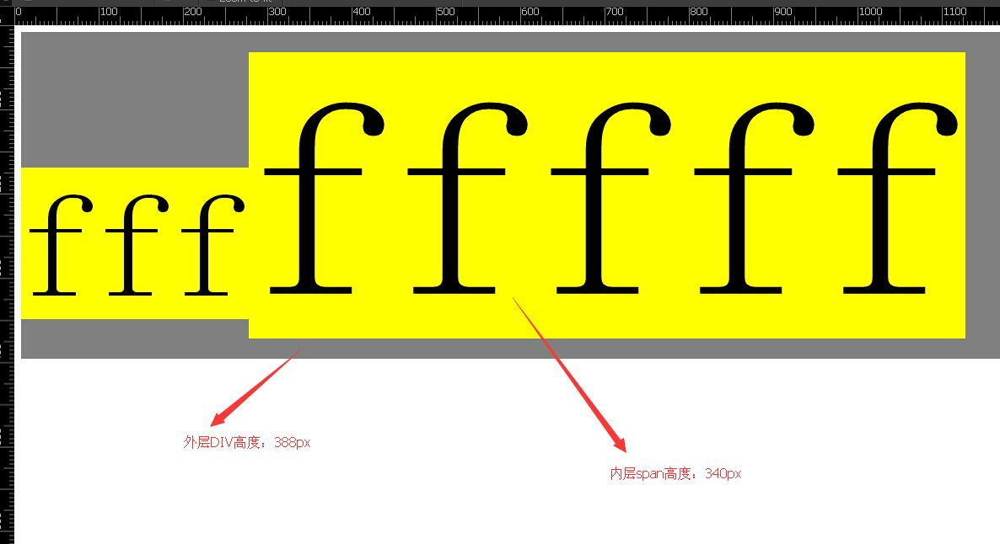

### display:inline和display:inline-block的区别

先来一张图：<br>


测试代码：
```HTML
<!DOCTYPE html>
<html>
<head>

    <style>
        #bb {
            overflow: hidden;
            background-color: gray;
        }
        #bb .f1 {
            font-size: 180px;
            background-color: yellow;
        }
        #bb .f2 {
            font-size: 340px;
            background-color: yellow;
        }
        #bb > div {
            display: table-cell;
        }
        #bb span {

        }
    </style>
  </head>
<body>
    <div id="bb">
        <div>
            <span class="f1">fff</span>
        </div>
        <div>
            <span class="f2">fffff</span>
        </div>
    </div>
</body>
</html>
```
效果如下：<br>


div和span上下是有空隙的这个空隙就是<span style="color: red">行间距</span>。

改变代码以后，使用display:inline-block之后呢？
```CSS
#bb span {
    display: inline-block;
}
```


span和div中间没有空隙了，但是行间距依然存在，不过这回行间距在span元素里面了，span的高度变成了388px，和外层div高度一样。


原因应该是inline-block的line-height撑开了他。
