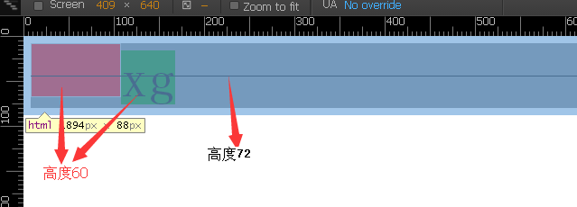

### vertical-align各属性对比

测试用代码

```HTML
<!DOCTYPE html>
<html>
<head>

    <style>
        #dd {
            //line-height: 300px;
            background-color: gray;
            position: relative;
            font-size: 60px;
            //height: 300px;
        }
        #dd > .middle {
            position: absolute;
            top: 50%;
            height: 1px;
            background-color: black;
            left: 0;
            right: 0px;
        }
        #dd span {
            background-color: green;

        }
    </style>
  </head>
<body>
    <div id="dd">
        <span>xg</span>
        <div class="middle"></div>
    </div>
</body>
</html>
```


默认的是按baseline对齐

去掉图片试试：<br>


 这里xg span的高度是60,68的高度是line-height,上图高72是图片把div撑开了，可以看出span的底部到baseline的距离是8

给img添加 <span style="color:red">vertical-align:bottom</span>; 后：<br>


图片和div的底边对齐

<span style="color: red">vertical-align:text-bottom</span><br>


和\<span\>对齐

<span style="color: red">vertical-align:sub;</span><br>


和vertical-align:bottom;类似，但是更低一些

<span style="color: red">vertical-align:middle;</span><br>


图片偏下了

将img的height改成1试一试<br>


原来是跟x居中对齐了
