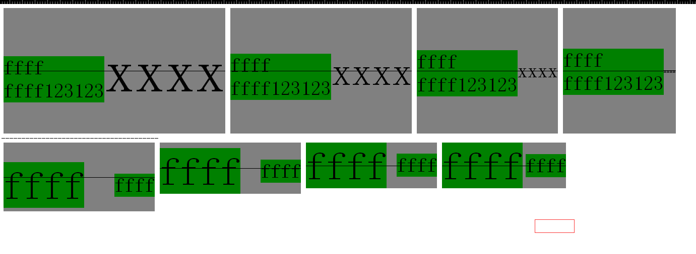

### 一张图片解释怎么让多行文本垂直居中对齐
```HTML
<!DOCTYPE html>
<html>
<head>

    <style>
        .dd {
            background-color: gray;
            line-height: 250px;
            text-align: center;
            position: relative;
        }
        .dd span {
            display: inline-block;
            line-height: normal;
            text-align: left;
            font-size: 40px;
            vertical-align: middle;
            background-color: green;
        }
        .middle {
            position: absolute;
            top: 50%;
            height: 1px;
            background-color: black;
            left: 0;
            right: 0px;
        }
        .d1 {
            font-size: 120px;
        }
        .d2 {
            font-size: 80px;
        }
        .d3 {
            font-size: 40px;
        }
        .d4 {
            font-size: 1px;
        }
        .groupdiv >    div {
            float: left;
            margin: 0px 5px;
        }
        .groupdiv {
            overflow: hidden;
        }
    </style>
  </head>
<body>
    <div class = 'groupdiv'>
        <div class="dd d1">
            <span>ffff<br/>ffff123123</span>xxxx
            <div class="middle"></div>
        </div>
        <div class="dd d2">
            <span>ffff<br/>ffff123123</span>xxxx
            <div class="middle"></div>
        </div>
        <div class="dd d3">
            <span>ffff<br/>ffff123123</span>xxxx
            <div class="middle"></div>
        </div>
        <div class="dd d4">
            <span>ffff<br/>ffff123123</span>xxxx
            <div class="middle"></div>
        </div>
    </div>
    <div>---------------------------------------</div>
    <div class = 'groupdiv'>
        <div class="dd d1" style="line-height: normal;">
            <span style="font-size:80px;">ffff</span>
            <span style="font-size:40px;">ffff</span>
            <div class="middle"></div>
        </div>
        <div class="dd d2" style="line-height: normal;">
            <span style="font-size:80px;">ffff</span>
            <span style="font-size:40px;">ffff</span>
            <div class="middle"></div>
        </div>
        <div class="dd d3" style="line-height: normal;">
            <span style="font-size:80px;">ffff</span>
            <span style="font-size:40px;">ffff</span>
            <div class="middle"></div>
        </div>
        <div class="dd d4" style="line-height: normal;">
            <span style="font-size:80px;">ffff</span>
            <span style="font-size:40px;">ffff</span>
            <div class="middle"></div>
        </div>
    </div>
</body>
</html>
```

