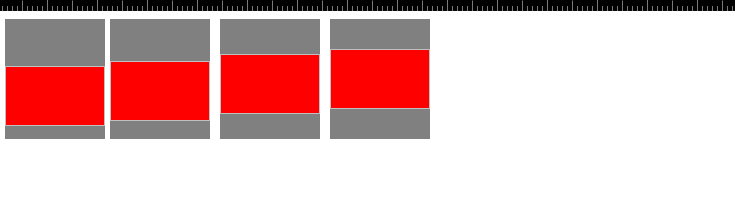
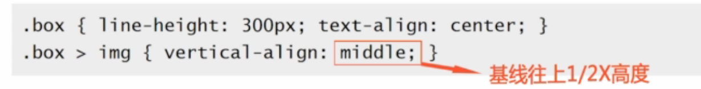

### 一张图解析如何让img垂直居中对齐

测试代码:
```HTML
<!DOCTYPE html>
<html>
<head>

    <style>
        .dd {
            background-color: gray;
            position: relative;
            line-height: 120px;
        }
        .d1 {
            font-size: 120px;
        }
        .d2 {
            font-size: 80px;
        }
        .d3 {
            font-size: 40px;
        }
        .d4 {
            font-size: 0px;
        }
        div {
            float: left;
        }
        div + div {
            margin: 0px 5px;
        }
    </style>
  </head>
<body>
    <div class="dd d1">
        
    </div>
    <div class="dd d2">
        
    </div>
    <div class="dd d3">
        
    </div>
    <div class="dd d4">
        
    </div>
</body>
</html>
```

发现没，跟font-size关系很大，<span style="color:red">vertical-align:middle</span>的原理是：



所以font-size越小，这个对齐线越接近div的中间线。

vertical-align：middle属性见<br>
[vertical-align各属性对比](../vertical-align各属性对比/index.md)
