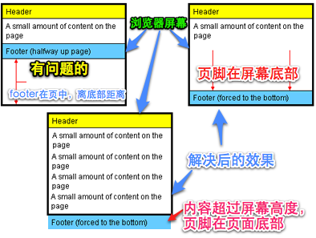

### 让页脚footer永远固定在页面的底部，而不是永远固定在显示器屏幕的底部的方法



```HTML
<!DOCTYPE html>
<html lang="en">
<head>
    <meta charset="UTF-8">
    <title>Document</title>
    <style>
    html,body {
        height: 100%;
        padding: 0;
        margin: 0;
        text-align: center;
    }

    #container {
        min-height: 100%;
        position: relative;
    }
    .header {
        line-height: 80px;
        font-size: 60px;
        height: 80px;
        background-color: #eee;
    }
    .body {
        font-size: 40px;
        padding-bottom: 80px;
    }
    .footer{
        line-height: 80px;
        height: 80px;
        width: 100%;
        font-size: 60px;
        position: absolute;
        background-color: #eee;
        bottom: 0;
    }
    </style>
</head>
<body>
    <div id="container">
        <div class="header">header</div>
        <div class="body">
        body<br>body<br>body<br>body<br>body<br>
        </div>
        <div class="footer">footer</div>
    </div>
</body>
</html>
```

```HTML
<!DOCTYPE html>
<html lang="en">
<head>
    <meta charset="UTF-8">
    <title>Document</title>
    <style>
    html,body {
        height: 100%;
        padding: 0;
        margin: 0;
        text-align: center;
    }

    .header {
        line-height: 80px;
        font-size: 60px;
        height: 80px;
        background-color: #eee;
        position: fixed;
        left:0;
        right:0;
    }
    .body {
        font-size: 40px;
        padding-bottom: 80px;
        min-height: 100%;
        box-sizing: border-box;
        padding-top:80px;
        margin-bottom: -80px;
    }
    .footer{
        line-height: 80px;
        height: 80px;
        width: 100%;
        font-size: 60px;

        background-color: #eee;

    }
    </style>
</head>
<body>

    <div class="header">header</div>
    <div class="body">
    body<br>body<br>body<br>body<br>body<br>
    </div>
    <div class="footer">footer</div>

</body>
</html>
```
