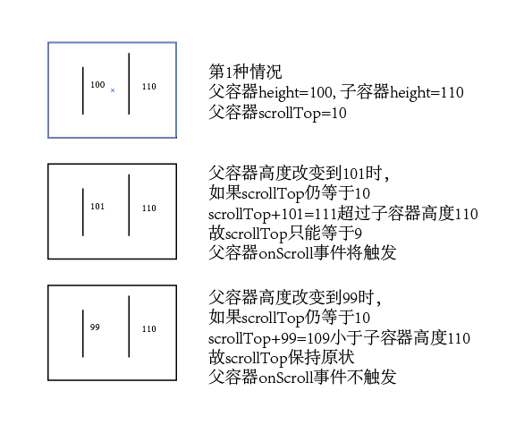
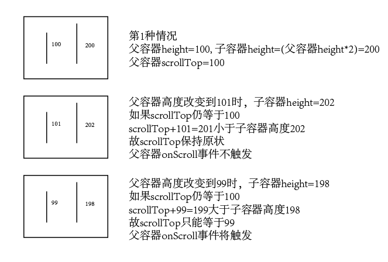

### 为网页元素增加resize事件

默认只有window支持resize事件，但有时我们需要为div等元素添加resize事件

<span style="color: red">方法1：</span>

代码见下面，原理是在元素内添加一个内嵌html，然后监听这个内嵌html的resize事件

```javascript
import { Injectable } from '@angular/core';

@Injectable()
export class ResizeEventService {
  isIE: boolean;

  constructor() {
    this.isIE = /Trident/.test(navigator.userAgent);
  }

  addResizeListener(element: any, fn: any) {
    const self = this;
    if (!element.__resizeListeners__ || element.__resizeListeners__.length === 0) {
      element.__resizeListeners__ = [];
      if (getComputedStyle(element).position === 'static') { element.style.position = 'relative'; }
      const obj = element.__resizeTrigger__ = document.createElement('object') as any;
      obj.setAttribute('style',
        'display: block; position: absolute; top: 0; left: 0; height: 100%;'
        + 'width: 100%; overflow: hidden; pointer-events: none; z-index: -1;');
      obj.__resizeElement__ = element;
      obj.onload = function() {
        this.contentDocument.defaultView.__resizeTrigger__ = this.__resizeElement__;
        this.contentDocument.defaultView.addEventListener('resize', self.resizeListener);
      };
      obj.type = 'text/html';
      if (this.isIE) { element.appendChild(obj); }
      obj.data = 'about:blank';
      if (!this.isIE) { element.appendChild(obj); }

    }
    element.__resizeListeners__.push(fn);
  }

  removeResizeListener(element: any, fn: any) {
    if (!element.__resizeListeners__) {
      return;
    }
    element.__resizeListeners__.splice(element.__resizeListeners__.indexOf(fn), 1);
    if (!element.__resizeListeners__.length) {
      element.__resizeTrigger__.contentDocument.defaultView.removeEventListener('resize', this.resizeListener);
      element.__resizeTrigger__ = !element.removeChild(element.__resizeTrigger__);
    }
  }

  private resizeListener(e: Event) {
    const win = e.target || e.srcElement as any;
    if (win.__resizeRAF__) { window.cancelAnimationFrame(win.__resizeRAF__); }
    win.__resizeRAF__ = window.requestAnimationFrame(function() {
      const trigger = win.__resizeTrigger__;
      trigger.__resizeListeners__.forEach(function(fn: any) {
        fn.call(trigger, e);
      });
    });
  }
}
```

<span style="color: red">方法2：</span>

巧用onScroll事件

浏览器内dom元素高度改变时，如果dom有scrollTop或scrollLeft属性，scrollTop或scrollLeft默认保持原状。

但在特定情况下scrollTop或scrollLeft不能保持原状，此时会触发dom的onScroll事件，可以以此来做出dom大小改变的判断。

后面以dom高度变化来讨论如何监听dom的resize事件。

1.高度变高时



2.高度变低时



代码示例

```javascript
<!DOCTYPE html>
<html lang="en">
<head>
  <meta charset="UTF-8">
  <meta name="viewport" content="width=device-width, initial-scale=1.0">
  <meta http-equiv="X-UA-Compatible" content="ie=edge">
  <title>Document</title>

  <script src="http://cdn.staticfile.org/less.js/1.1.0/less.js"></script>
  <style>
    .expandParent {
      width: 100px;
      height: 100px;
      position: relative;
      overflow: auto;
      resize: vertical;
    }
    .expandChild {
      position: absolute;
      top: 0;
      right: 0;
      width: 100%;
      height: 110px;
      background: red;
    }

    .shrinkParent {
      width: 100px;
      height: 100px;
      position: relative;
      overflow: auto;
      resize: vertical;
    }
    .shinkChild {
      position: absolute;
      top: 0;
      right: 0;
      width: 100%;
      height: 200%;
      background: red;
    }
    .test {
      width: 100px;
      height: 100px;
      resize: vertical;
      overflow: hidden;
      position: relative;
    }
  </style>
</head>
<body>
  <div class="expandParent">
    <div class="expandChild"></div>
  </div>
  <div id="expandLog"></div>
  <div class="shrinkParent">
    <div class="shinkChild"></div>
  </div>
  <div id="shrinkLog"></div>

  <script>
    window.onload = function() {
      var expandLog = document.querySelector('#expandLog');
      var shrinkLog = document.querySelector('#shrinkLog');
      var shrinkLog = document.querySelector('#shrinkLog');
      var expandParent = document.querySelector('.expandParent');
      var expandChild = document.querySelector('.expandChild');
      var shrinkParent = document.querySelector('.shrinkParent');
      var shinkChild = document.querySelector('.shinkChild');
      var expandNum = 0;
      var shrinkNum = 0;

      expandParent.scrollTop = 10;
      shrinkParent.scrollTop = 100;

      expandParent.addEventListener('scroll', function() {
        expandNum += 1;
        expandLog.innerHTML = 'expand ' + expandNum + ' times.';
      });

      shrinkParent.addEventListener('scroll', function() {
        shrinkNum += 1;
        shrinkLog.innerHTML = 'shrink ' + shrinkNum + ' times.';
      });
    }

  </script>
</body>
</html>
```

如此，在需要监听resize的dom中插入expandParent和shrinkParent辅助元素，通过expandParent和shrinkParent的onScroll事件即可监听dom的resize事件。

具体代码去看css-element-queries的ResizeSensor.js。

<span style="color: red">方法3：</span>

 使用ResizeObserver [检测DOM尺寸变化JS API ResizeObserver简介](https://www.zhangxinxu.com/wordpress/2020/03/dom-resize-api-resizeobserver/)
