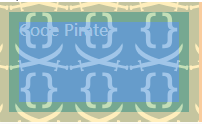

### background-color和background-image相关细节
1.background-color 是以border-box作为他的左上角来定位的

2.background-image 默认是以padding-box作为他的左上角来定位的

3.background-origin 可以改变background-image 的定位位置

4.background-image 设置repeat的话会重复自己并且占据容器左上角，如图


5.background-clip 可以设置background-color和background-image的裁剪范围

6.background-position 中可以使用calc,比如

```CSS
background-position: calc(100% - 20px) calc(100% - 10px);
```
可以设置背景图片定位在距左边20px，下边10px的位置上，同
```CSS
background-position: right 20px bottom 10px;
```
