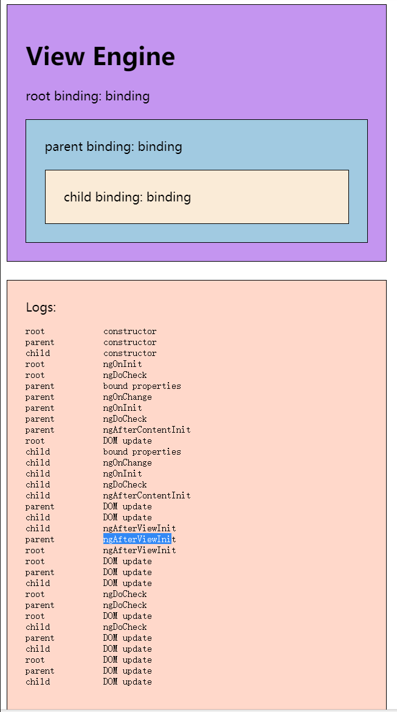

### ExpressionChangedAfterItHasBeenCheckedError详细解释

一个angular组件，他的生命周期是这样的

* update bound properties for all child components/directives
* call ngOnInit, OnChanges and ngDoCheck lifecycle hooks on all child components/directives
* update DOM for the current component
* run change detection for a child component
* call ngAfterViewInit lifecycle hook for all child components/directives

1，接父节点发来的input参数，并把这时的input参数保存，记为oldInput

2，按ngOnChange,ngOnInit,ngDoCheck的顺序调用自己的生命周期函数

3，如果有子组件，将子组件的input参数下传，并依次调用子组件的ngOnChange,ngOnInit,ngDoCheck参数

4，自身做变化检测，同时更新自己的dom结构，将此时的dom结构保存，记为olddom

5，子组件进行变化检测，同时更新子组件的dom结构

6，子组件调用ngAfterViewInit

7，自身调用ngAfterViewInit

8，如果是开发模式，会进行第2轮循环，重复1-7

9，第2轮循环的1,4步骤如果发现oldInput不等于input或者olddom不等于dom，就会报ExpressionChangedAfterItHasBeenCheckedError错误

如何避免：

1，不要在ngOnChange,ngOnInit,ngDoCheck里面改变父组件下传的input参数

2，不要在ngAfterViewInit里改变父组件或自身的dom结构

3，可以用异步的方式做变更

4，在父组件的ngAfterViewInit最后调用this.cd.detectChanges();（不推荐）

为什么要做这个检测：

是为了保证angular单向数据流的稳定性，数据要保证从父组件流向子组件，如果数据流不是按照从上往下的顺序，就会出现互相依赖的关系，容易造成循环依赖，可能让angular应用出现卡死的状况。

所以如果在开发过程中发现了ExpressionChangedAfterItHasBeenCheckedError的错误，一定要小心排查。
