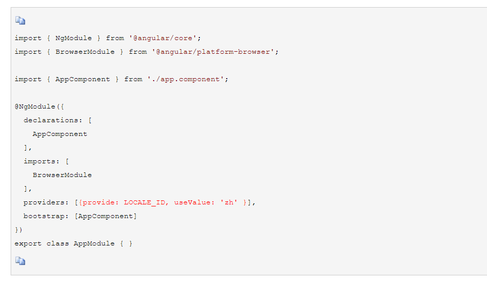
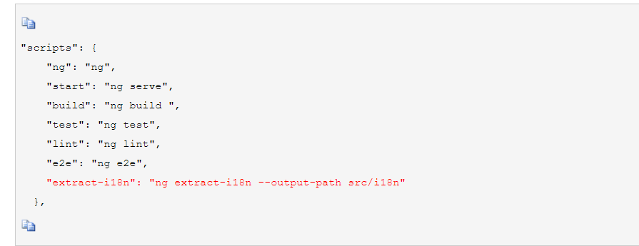
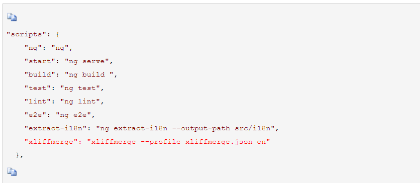
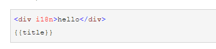
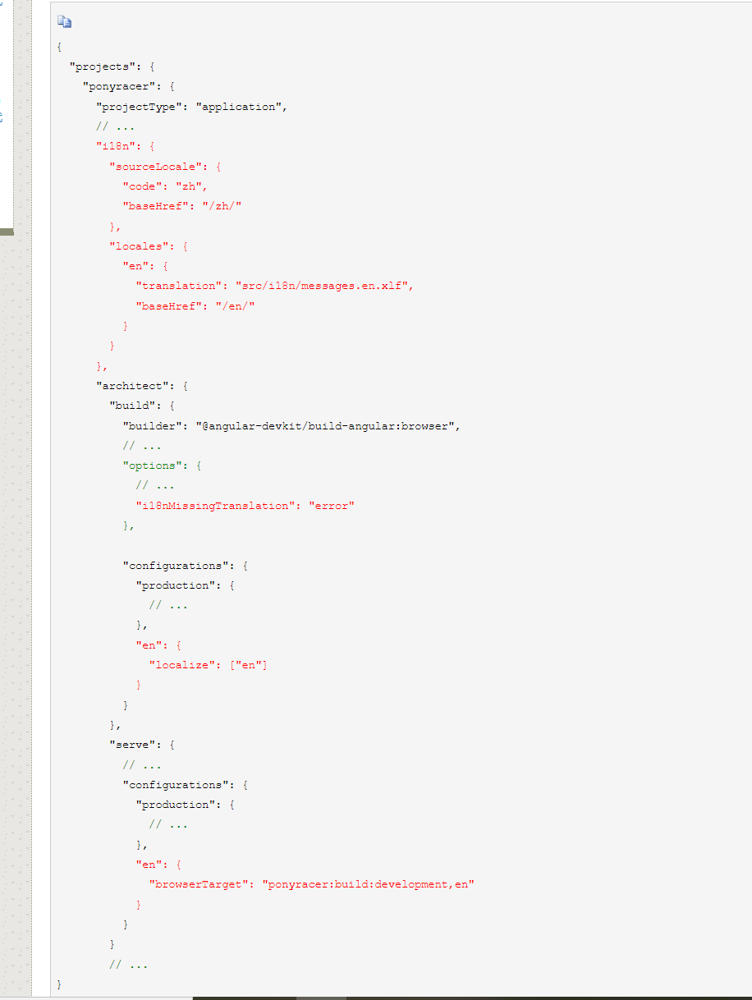
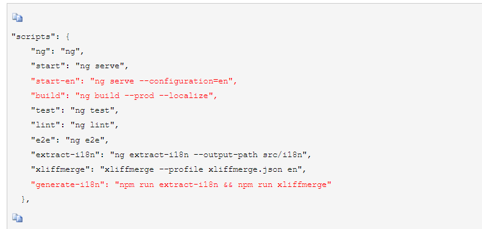

### 一步一步在angular11中添加多语言支持

1.新建angular

2.添加@angular/localize

```
ng add @angular/localize
```

3.设置默认locale_id，在app.module.ts中<span style="color: red">(忽略此步)</span>



4.设置翻译文件输出路径，在package.json中



5.添加ngx-i18nsupport

```
npm install ngx-i18nsupport --save-dev
```

6.在根目录下添加xliffmerge.json

```json
{
  "xliffmergeOptions": {
    "srcDir": "src/i18n",
    "genDir": "src/i18n",
    "defaultLanguage": "zh",
    "languages": ["en"]
  }
}
```

7.添加翻译合并脚本，在package.json中



8.在文件中增加翻译文本

HTML中



typescript中

```typescript
export class AppComponent {
  title = 'angular-i18n';

  constructor() {
    this.title = $localize`world ${'abc'}`;
  }
}
```

9.尝试生成翻译文件

```
npm run extract-i18n;npm run xliffmerge;
```

这一步之后在工程的src/i18n文件夹会生成2个文件message.xlf,message.en.xlf

其中message.xlf是从工程中提取的所有待翻译语句，message.en.xlf是留存的已翻译好的文件。

也就是说，每次运行npm run extract-i18n;npm run xliffmerge;，message.xlf会重新生成而message.en.xlf会增量增加，已翻译的内容不会变

10.修改angular.json



之后运行ng build --configuration='production,en'将生成英文版的打包文件

运行ng build --prod --localize将同时生成中文和英文的打包文件

11.增加脚本，修改package.json



12.参考链接

* [Internationalization with @angular/localize](https://blog.ninja-squad.com/2019/12/10/angular-localize/)
* [使用 xliffmerge 讓 Angular i18n 更強大](https://www.dazhuanlan.com/innerunniverse/topics/1474804)
