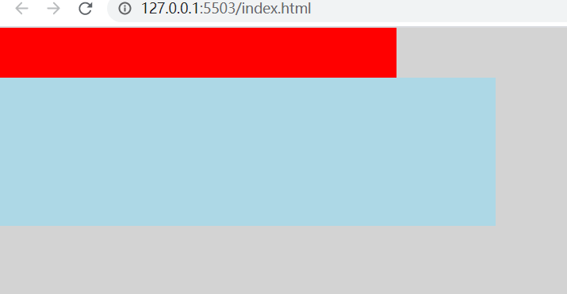
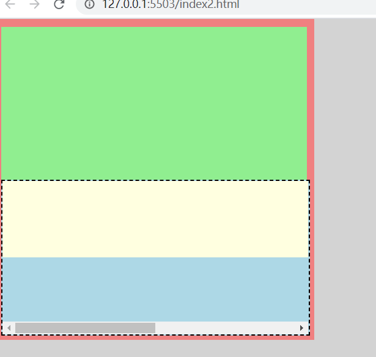

### html元素height(width)是怎么确定的？

1.若height是确定的（比如height:100px)，则height直接可确定（还受min-height,max-height影响，[见height,min-height,max-heigth的作用机制问答](../height,min-height,max-heigth的作用机制问答/index.md))。

2.若width是不确定的（比如width: min-content 或 width:100px,min-width:fit-content），此时width受子元素影响   <span style="color: red">（height:100px,min-height:fit-content时heigth已确定就是100px,可以直接设置min-height:100px达到width:100px,min-height:fit-content的效果）</span>

则依次确定每一个子元素的width，如果子元素的width可以由自己确定（比如子元素width写死了或者子元素width为min-content,max-content都能确定）则设置width为子元素width，如果子元素的width不能确定（比如写的width为100%，fit-content等需要确定外部元素高度的属性）则递归计算子元素的width，然后设置父元素width为最大宽度子元素的width，再用这个width去确定子元素中需要使用外部元素宽度来确定本身宽度的宽度。

看几个例子

1.父元素min-height: 100px，子元素height: 100%;

这个情况子元素最终高度为0。

2.父元素width: 0;子元素1 width: 100%;子元素2 width: 100px.

这个情况子元素1最终宽度 100px;

3.<br>

```html
<!DOCTYPE html>
<html lang="en">
<head>
    <meta charset="UTF-8">
    <meta http-equiv="X-UA-Compatible" content="IE=edge">
    <meta name="viewport" content="width=device-width, initial-scale=1.0">
    <title>Document</title>
    <style>
        html, body {
            padding: 0;
            margin: 0;
            height: 100%;
            background: lightgray;
        }
        .container {
            width: 400px;
            height: 200px;
            min-width: fit-content;
        }
        .header {
            height: 50px;
            background: red;
        }
        .body {
            width: 500px;
            height: 150px;
            background: lightblue;
        }
    </style>
</head>
<body>

    <div class="container">
        <div class="header"></div>

        <div style="display: flex;height: 100%;">
            <div style="flex-grow: 1; width: 0">
                <div class="body">

                </div>
            </div>
        </div>

    </div>
</body>
</html>
```



这个例子中，flex-grow: 1; width: 0，这个元素已经确定了width，宽度确定就不会往他的子元素进行了，container元素再确定子元素宽度的时候会认为flex元素的宽度为0。最后的结果就是flex元素的最终宽度就是container的宽度而不会是body元素的宽度。

4.<br>
```html
<!DOCTYPE html>
<html lang="en">
<head>
    <meta charset="UTF-8">
    <meta http-equiv="X-UA-Compatible" content="IE=edge">
    <meta name="viewport" content="width=device-width, initial-scale=1.0">
    <title>Document</title>
    <style>
        html, body {
            padding: 0;
            margin: 0;
            height: 100%;
            background: lightgray;
        }
        .container {
            width: 400px;
            height: 400px;
            min-width: fit-content;
            padding: 10px;
            background: lightcoral;
        }
        .header {
            height: 200px;
            background: lightgreen;
        }
        .body {
            height: 200px;
            width: 100%;
            background: lightblue;
            overflow: auto;
        }
        .child {
            width: 800px;
            height: 100px;
            background: lightyellow;
        }
    </style>
</head>
<body>
    <div class="container">
        <div class="header"></div>
        <div class="body">
            <div class="child"></div>
        </div>
    </div>
</body>
</html>
```
这个例子body不会出现滚动条，因为container的width需要子元素来确定，body在第一轮计算最大宽度的时候递归到了child里面得出了结果800，就不需要开滚动条了。

要想让body在计算宽度的时候不受child影响，须在递归进入child之前确定body的宽度，办法就是例3里面的使用flex

```html
<!DOCTYPE html>
<html lang="en">
<head>
    <meta charset="UTF-8">
    <meta http-equiv="X-UA-Compatible" content="IE=edge">
    <meta name="viewport" content="width=device-width, initial-scale=1.0">
    <title>Document</title>
    <style>
        html, body {
            padding: 0;
            margin: 0;
            height: 100%;
            background: lightgray;
        }
        .container {
            width: 400px;
            height: 400px;
            min-width: fit-content;
            padding: 10px;
            background: lightcoral;
        }
        .header {
            height: 200px;
            background: lightgreen;
        }
        .body {
            border: 2px dashed black;
            height: 200px;
            width: 100%;
            background: lightblue;
            overflow: auto;
        }
        .child {
            width: 800px;
            height: 100px;
            background: lightyellow;
        }
    </style>
</head>
<body>
    <div class="container">
        <div class="header"></div>
        <div class="flex" style="display: flex;height: 100%;">
            <div style="flex-grow: 1; width: 0">
                <div class="body">
                    <div class="child"></div>
                </div>
            </div>
        </div>
    </div>
</body>
</html>
```

