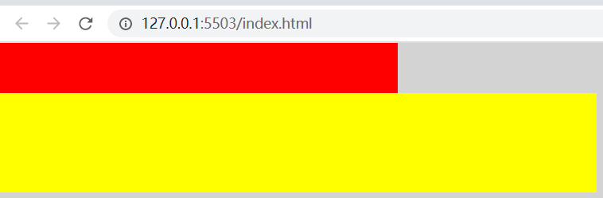
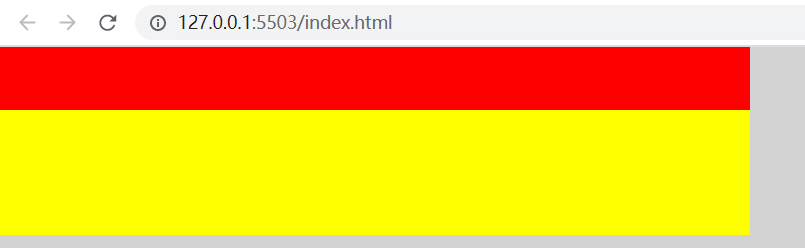

### 使用fit-content撑开子元素

```html
<!DOCTYPE html>
<html lang="en">
<head>
    <meta charset="UTF-8">
    <meta http-equiv="X-UA-Compatible" content="IE=edge">
    <meta name="viewport" content="width=device-width, initial-scale=1.0">
    <title>Document</title>
    <style>
        html, body {
            padding: 0;
            margin: 0;
            /* height: 2400px; */
            height: 100%;
            background: lightgray;
        }
        .container {
            width: 400px;
        }
        .header {
            height: 50px;
            background: red;
        }
        .body {
            height: 100px;
            background: yellow;
            width: 600px;
        }
    </style>
</head>
<body>
    <div class="container">
        <div class="header"></div>
        <div class="body"></div>
    </div>
</body>
</html>
```



上面的例子body比container还宽，header使用了container的宽度，所以出现了上短下长。

让container设置min-width: fit-content能解决这个问题。

```html
<!DOCTYPE html>
<html lang="en">
<head>
    <meta charset="UTF-8">
    <meta http-equiv="X-UA-Compatible" content="IE=edge">
    <meta name="viewport" content="width=device-width, initial-scale=1.0">
    <title>Document</title>
    <style>
        html, body {
            padding: 0;
            margin: 0;
            /* height: 2400px; */
            height: 100%;
            background: lightgray;
        }
        .container {
            width: 400px;
            min-width: fit-content;
        }
        .header {
            height: 50px;
            background: red;
        }
        .body {
            height: 100px;
            background: yellow;
            width: 600px;
        }
    </style>
</head>
<body>
    <div class="container">
        <div class="header"></div>
        <div class="body"></div>
    </div>
</body>
</html>
```


