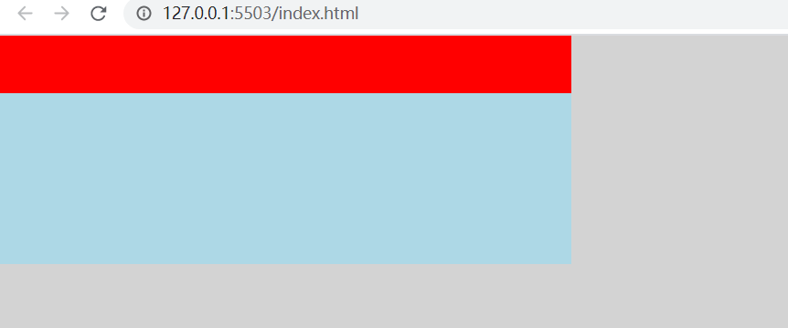
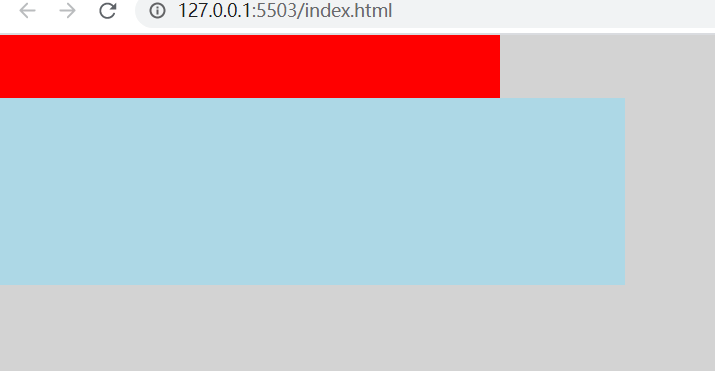

### 使用flex防止fit-content子元素冲出父元素宽度的方法

父元素设置了min-width:fit-content后，其宽度由子元素的宽度来决定

```html
<!DOCTYPE html>
<html lang="en">
<head>
    <meta charset="UTF-8">
    <meta http-equiv="X-UA-Compatible" content="IE=edge">
    <meta name="viewport" content="width=device-width, initial-scale=1.0">
    <title>Document</title>
    <style>
        html, body {
            padding: 0;
            margin: 0;
            height: 100%;
            background: lightgray;
        }
        .container {
            width: 400px;
            height: 200px;
            min-width: fit-content;
        }
        .header {
            height: 50px;
            background: red;
        }
        .body {
            width: 500px;
            height: 150px;
            background: lightblue;
        }
    </style>
</head>
<body>

    <div class="container">
        <div class="header"></div>
        <div class="body">

        </div>


    </div>
</body>
</html>
```



看到父元素的宽度被body元素顶开了。

如果不想子元素顶开父元素宽度，而是将子元素的最大宽度设定为父元素的原始宽度，应该使用flex包裹子元素。

```html
<!DOCTYPE html>
<html lang="en">
<head>
    <meta charset="UTF-8">
    <meta http-equiv="X-UA-Compatible" content="IE=edge">
    <meta name="viewport" content="width=device-width, initial-scale=1.0">
    <title>Document</title>
    <style>
        html, body {
            padding: 0;
            margin: 0;
            height: 100%;
            background: lightgray;
        }
        .container {
            width: 400px;
            height: 200px;
            min-width: fit-content;
        }
        .header {
            height: 50px;
            background: red;
        }
        .body {
            width: 500px;
            height: 150px;
            background: lightblue;
        }
    </style>
</head>
<body>

    <div class="container">
        <div class="header"></div>

        <div style="display: flex;height: 100%;">
            <div style="flex-grow: 1; width: 0">
                <div class="body">

                </div>
            </div>
        </div>

    </div>
</body>
</html>
```


