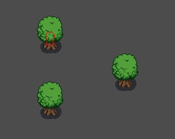

# 要解决的问题
godot游戏中对角色和景物（比如树）设置了Y-sort之后，人物站在树的后面会被树挡住。如果这时需要玩家看到人物的动作，需要显示人物的轮廓。
要实现的效果如图：



# 思路
在场景的顶层设置一个z-index比较高的Subviewport节点，让设置了y-sort的节点（玩家和遮挡物）复制自身到这个节点下成为它的字节点，对复制的这些节点设置shader，让他们的颜色统一为(0.0,0.0,1.0,0.5)。
```
void fragment() {
	// 用蓝色表示其他物体
	COLOR.rgb = vec3(0.,0.,1.);
	if (texture(TEXTURE,UV).a > 0.0) {
		COLOR.a = 0.5;
	} else {
		COLOR.a = 0.0;
	}
}
```
这样，当两个或更多节点重合叠加的时候，叠加的颜色蓝色数值会大于等于0.75，
为Subviewport设置shader，当原来的蓝色大于0.7的时候显示红色，当原来的蓝色小于0.7的时候显示透明色。这样重叠的部分就会变成红色。
这时有一个问题，就是当角色站在树的前面的时候，角色的头和树重叠了，会导致角色的头变成红色。可以通过下面的方法解决这个问题：
将角色的颜色设置为(1.0,0.0,1.0,0.5);
```
void fragment() {
	// 用红色表示角色
	COLOR.rgb = vec3(1.,0.,1.);
	if (texture(TEXTURE,UV).a > 0.0) {
		COLOR.a = 0.5;
	} else {
		COLOR.a = 0.0;
	}
}
```
在Subviewport的shader里面判断，当原来的红色大于0.49的时候显示透明色。这样处理后角色站在树的前面，他的头也不会变成红色了。

# 具体代码
角色脚本：
```py
extends CharacterBody2D


const SPEED = 100.0
const JUMP_VELOCITY = -400.0

var maskNode: Node2D

var isMask = false

# Get the gravity from the project settings to be synced with RigidBody nodes.
var gravity = ProjectSettings.get_setting("physics/2d/default_gravity")

func _ready():
	if isMask:
		return
	var maskLayer = get_tree().get_first_node_in_group("mask_layer")
	if maskLayer:
		maskNode = duplicate()
		maskNode.isMask = true
		var material = ShaderMaterial.new()
		material.shader = load("res://outline/mask_player.gdshader")
		maskNode.find_child("displayed_item").material = material
		maskLayer.add_child(maskNode)

func _process(delta):
	if maskNode:
		maskNode.position = position

func _physics_process(delta):
	if isMask:
		return
	# Get the input direction and handle the movement/deceleration.
	# As good practice, you should replace UI actions with custom gameplay actions.
	var directionX = Input.get_axis("ui_left", "ui_right")
	if directionX:
		velocity.x = directionX * SPEED
	else:
		velocity.x = move_toward(velocity.x, 0, SPEED)

	var directionY = Input.get_axis("ui_up", "ui_down")
	if (directionY):
		velocity.y = directionY * SPEED
	else:
		velocity.y = move_toward(velocity.y, 0, SPEED)

	move_and_slide()

```
遮挡物脚本：
```py
extends Node2D

var isMask = false

# Called when the node enters the scene tree for the first time.
func _ready():
	if isMask:
		return
	var maskLayer = get_tree().get_first_node_in_group("mask_layer")
	if maskLayer:
		var maskNode = duplicate()
		maskNode.isMask = true
		var material = ShaderMaterial.new()
		material.shader = load("res://outline/mask_item.gdshader")
		maskNode.find_child("displayed_item").material = material
		maskLayer.add_child(maskNode)

# Called every frame. 'delta' is the elapsed time since the previous frame.
func _process(delta):
	pass
```

场景脚本：
```py
extends Node2D

var _player

# Called when the node enters the scene tree for the first time.
func _ready():
	var mapSceneFactory = preload("res://outline/map.tscn")
	var mapScene = mapSceneFactory.instantiate()
	add_child(mapScene)

	var playerSceneFactory = preload("res://outline/player.tscn")
	var playerScene = playerSceneFactory.instantiate()
	playerScene.position.x = 200;
	playerScene.position.y = 120;
	add_child(playerScene)
	pass


# Called every frame. 'delta' is the elapsed time since the previous frame.
func _process(delta):
	pass
```

角色shader脚本：
```
void fragment() {
	// 用红色表示角色
	COLOR.rgb = vec3(1.,0.,1.);
	if (texture(TEXTURE,UV).a > 0.0) {
		COLOR.a = 0.5;
	} else {
		COLOR.a = 0.0;
	}
}
```

遮挡物shader脚本：
```
void fragment() {
	// 用蓝色表示其他物体
	COLOR.rgb = vec3(0.,0.,1.);
	if (texture(TEXTURE,UV).a > 0.0) {
		COLOR.a = 0.5;
	} else {
		COLOR.a = 0.0;
	}
}
```

subviewport shader脚本：
```
uniform vec3 outline_color = vec3(1.0,0.0,0.0);

void fragment() {
	vec4 tex_color = texture(TEXTURE , UV);
	if (tex_color.r > 0.49) {
		// 显示主角
		COLOR= vec4(0.0);
	} else if (tex_color.b > 0.7) {
		// 显示重叠
		COLOR = tex_color;
		COLOR.rgb = outline_color.rgb;

		// We convert the pixel width we want for our outline in decimal texel size.
		vec2 size = vec2(1.0) / vec2(textureSize(TEXTURE, 0));

		// We sample and offset the texture 8 times to draw an outline.
		float alpha = 1.0;
		alpha += (texture(TEXTURE, UV + vec2(0.0, -size.y)).b > 0.7 ? 1.0 : 0.0);
		alpha += (texture(TEXTURE, UV + vec2(size.x, -size.y)).b > 0.7 ? 1.0 : 0.0);
		alpha += (texture(TEXTURE, UV + vec2(size.x, 0.0)).b > 0.7 ? 1.0 : 0.0);
		alpha += (texture(TEXTURE, UV + vec2(size.x, size.y)).b > 0.7 ? 1.0 : 0.0);
		alpha += (texture(TEXTURE, UV + vec2(0.0, size.y)).b > 0.7 ? 1.0 : 0.0);
		alpha += (texture(TEXTURE, UV + vec2(-size.x, size.y)).b > 0.7 ? 1.0 : 0.0);
		alpha += (texture(TEXTURE, UV + vec2(-size.x, 0.0)).b > 0.7 ? 1.0 : 0.0);
		alpha += (texture(TEXTURE, UV + vec2(-size.x, -size.y)).b > 0.7 ? 1.0 : 0.0);

		// If the summed alpha is too high, it means we're over the original texture
		// and we don't want to draw this pixel; it's not part of the outline.
		if (alpha >= 9.0) {
			alpha = 0.0;
		}

		// We then override the texture's color with the calculated outline.
		COLOR = vec4(outline_color.rgb, min(alpha, 1.0) * tex_color.a);
	} else {
		COLOR= vec4(0.0);
	}
}
```
示例代码请查看
[https://github.com/chen8840/godot4_examples/tree/master/silhouette](https://github.com/chen8840/godot4_examples/tree/master/silhouette)
