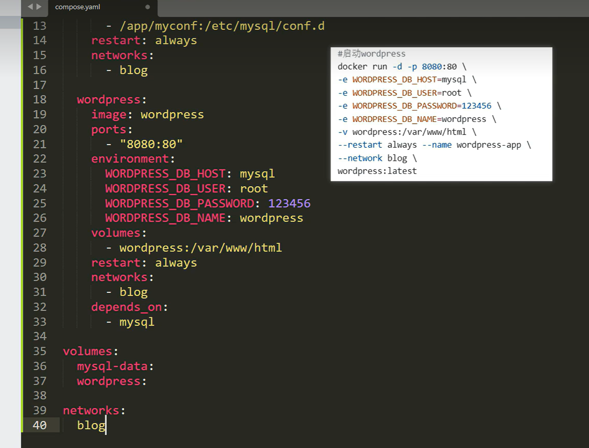

# 从docker命令到compose配置

# 说明：
* ### 关于project_name
  * 如果设定了name,项目名就是name的值，否则就是目录名。

* ### 关于Network
  * 自动创建网络：如果你没有在 docker-compose.yml 文件中特别指定网络配置，Docker Compose 会为你的项目（Project）创建一个默认的桥接网络 (bridge network)。
  * 网络命名规则：这个网络的名称是根据项目名来决定的，格式通常是 <project_name>_default。
    * 项目名 (<project_name>)：默认是包含 docker-compose.yml 文件的目录名。例如，如果你的文件在 my-app/ 目录下，网络名就会是 my-app_default。
  * 自动连接容器：Compose 会将 docker-compose.yml 中定义的所有服务（services）创建的容器都连接到这个默认网络上。
  * 自定义网络：如果你需要自定义网络，你可以在 docker-compose.yml 文件中指定 networks 部分，然后在 services 部分中引用它们。自定义网络名会加上项目名，如果自定义网络名为my-network，项目名为my-app，那么这个网络的名称就是 my-app_my-network。

* ### 关于Volumes
  * 使用docker inspect可以参看Mounts字段，里面的Source代表了挂载字段，比如"/var/lib/docker/volumes/<project_name>_<volume_name>/_data"，即挂载的目录。
  * windows下访问这个目录的地址是\\\\wsl$\docker-desktop\var\lib\docker\volumes\<project_name>_<volume_name>\_data，即在wsl环境下访问。